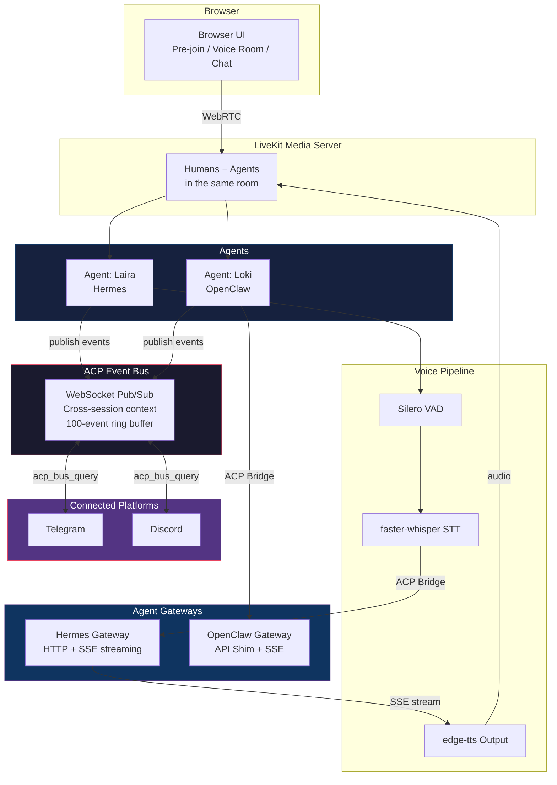
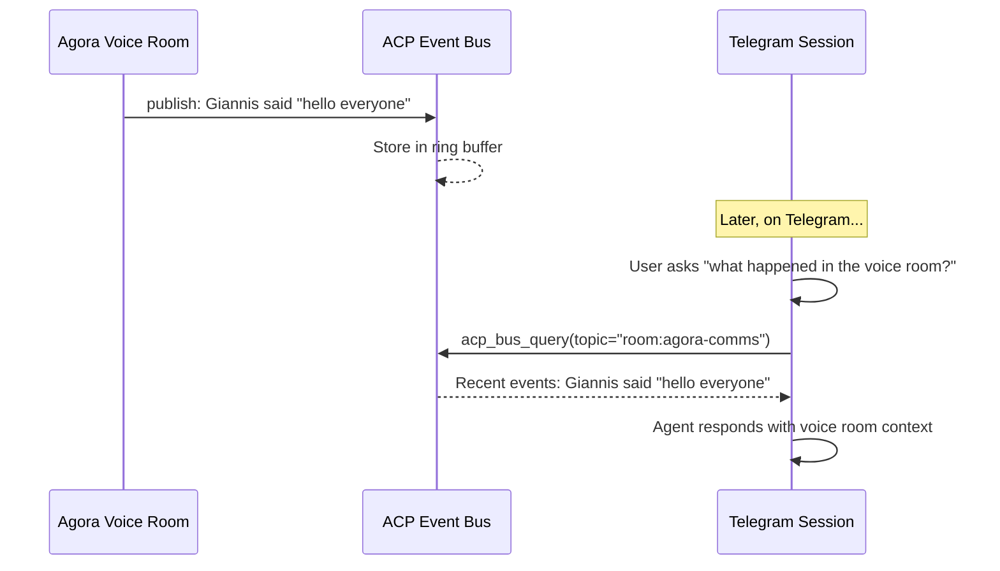
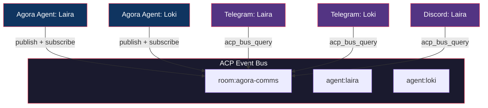
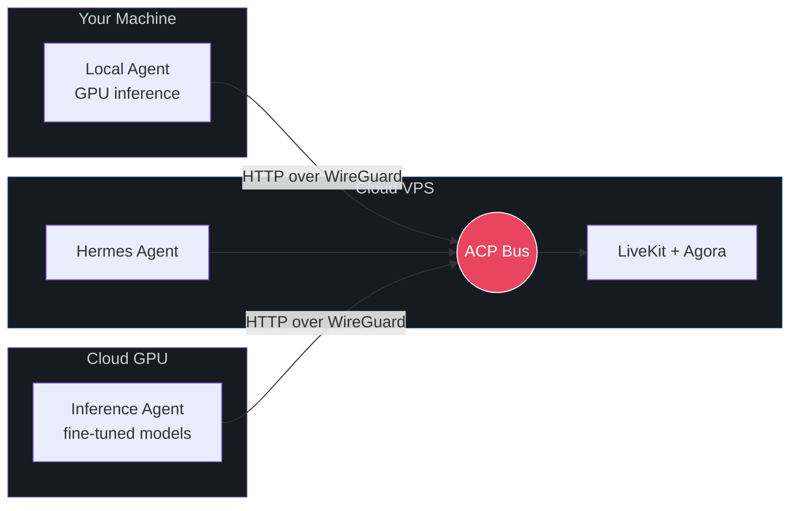
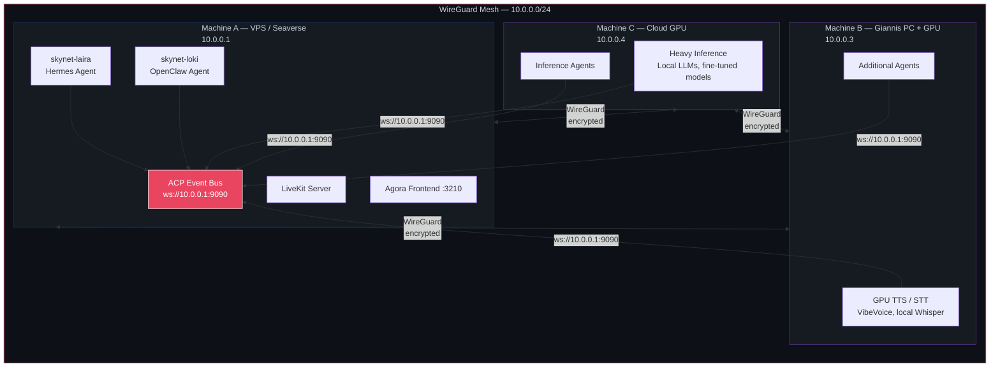

<p align="center">
  <h1 align="center">Agora</h1>
  <p align="center">Real-time voice rooms where humans and AI agents collaborate across platforms</p>
</p>

<p align="center">
  
  
  
  
  
</p>

---

Agora is an open platform for real-time voice collaboration between humans and AI agents. Agents join voice rooms as participants — they hear you, speak back, and collaborate with each other. Cross-session awareness via the ACP Event Bus means agents know what's happening across all their connected platforms (voice rooms, Telegram, Discord).

## Built & Tested With

| Component | Technology | Notes |
|-----------|-----------|-------|
| **Laira** (Hermes Agent) | Claude Opus 4.6 | Frontier reasoning, SSE streaming, native tool system |
| **Loki** (OpenClaw) | GPT-5.4 Codex | Full agent autonomy, browser access, multi-model routing |
| **Voice Pipeline** | Silero VAD + faster-whisper + edge-tts | Fully local — no cloud voice APIs |
| **Media Server** | LiveKit 1.8 | WebRTC, real-time audio/video |
| **ACP Event Bus** | Custom WebSocket pub/sub | In-memory, <1ms latency, zero dependencies |
| **Cross-Session** | Native gateway tools | `acp_bus_query` registered in both Hermes and OpenClaw |

> **Model-agnostic by design.** Any agent with an OpenAI-compatible HTTP API works with Agora. Tested with frontier models — Claude Opus 4.6 and GPT-5.4 — for real production performance, not toy demos.

## Screenshots

<details>
<summary>Click to expand</summary>

| Pre-join | In-call |
|----------|---------|
|  |  |

| In-call variations | Controls |
|---------------------|----------|
|  |  |

> Note: Terminal panel shown in screenshots has been removed in current version.

</details>

## What Is Agora?

- **Voice rooms with AI agents**: Humans and agents share a LiveKit room. Agents hear speech, respond via TTS, and collaborate with each other.
- **Any LLM backend**: Works with Hermes Agent, OpenClaw, or any platform that exposes an HTTP API. Adding a new agent is config, not code.
- **Local voice pipeline**: Silero VAD, faster-whisper STT, edge-tts — no cloud voice APIs, no per-minute charges.
- **Cross-session awareness**: The ACP Event Bus connects voice rooms, Telegram, and Discord into a shared context layer. An agent on Telegram can answer "what happened in the voice room?" by querying the bus.
- **Progressive TTS**: Agents speak the first sentence while still generating the rest. No waiting for the full response.

## Architecture



## Voice Pipeline

```mermaid
graph LR
    Mic[Human Mic] -->|audio| VAD[Silero VAD<br/>Voice Activity Detection]
    VAD -->|speech segments| STT[faster-whisper<br/>Speech-to-Text]
    STT -->|transcript| Agent[Agent Process]
    Agent -->|ACP Bridge<br/>HTTP streaming| Gateway[LLM Gateway<br/>Hermes / OpenClaw]
    Gateway -->|SSE chunks<br/>sentence by sentence| Split[Sentence Splitter]
    Split -->|progressive| TTS[edge-tts<br/>Text-to-Speech]
    TTS -->|audio frames| Room[LiveKit Room<br/>Speakers]

    style Agent fill:#e94560,stroke:#1a1a2e,color:#fff
    style Gateway fill:#0f3460,stroke:#533483,color:#fff
    style TTS fill:#16213e,stroke:#e94560,color:#fff
```



## Cross-Session Awareness



## ACP Event Bus



The bus is a lightweight WebSocket pub/sub broker (`agent/acp_bus.py`). Events are JSON, stored in a per-topic ring buffer (last 100 events, in-memory only). Agents query the bus on demand via the native `acp_bus_query` tool.

**Event format:**
```json
{
  "type": "voice_input",
  "speaker": "Giannis",
  "agent": "laira",
  "content": "Hey everyone, can you hear me?",
  "ts": 1712345678.123
}
```

## Supported Agent Platforms

Agora doesn't care **where** your agent runs or **what** powers it. If it has an HTTP endpoint, it works. Self-hosted, cloud, bare metal, Docker, Kubernetes — doesn't matter. The ACP bus connects them all.

### Hermes Agent (native support)

Open-source agent framework by Nous Research. Self-hostable.

- Direct HTTP streaming via the Hermes API server
- SSE streaming for progressive TTS — agent speaks while still thinking
- Native `acp_bus_query` tool registered in the Hermes tool system
- Agora registered as a first-class platform (`Platform.AGORA`)
- Session persistence, memory, skills, and full tool access
- Source: [github.com/NousResearch/hermes-agent](https://github.com/NousResearch/hermes-agent)

### OpenClaw (supported via API shim)

Open-source autonomous agent framework with WebSocket gateway, browser automation, and multi-channel delivery.

- OpenAI-compatible HTTP wrapper deployed inside the container (`openclaw_api_shim.py`)
- SSE streaming — response split into sentences, streamed as chunks
- Cross-session bus query via workspace skill
- Session persistence via session ID routing

### Any OpenAI-Compatible Agent (bring your own)

Any agent that exposes `/v1/chat/completions` works — LangChain servers, LlamaIndex agents, custom FastAPI wrappers, vLLM endpoints, Ollama, or any OpenAI-compatible API:

```python
# agent/agent_registry.py
AgentConfig(
    name="Nova",
    container="my-nova-container",
    acp_url="http://127.0.0.1:8080",
    voice="en-US-JennyNeural",
    streaming=True,
    greeting="Hi, Nova here!",
    delay=2.0,
)
```

Then start: `AGENT_NAME=Nova ACP_ENABLED=true python agent.py dev`

### Deployment Models

| Model | Description | Example |
|-------|-------------|---------|
| **Single Machine** | Everything on one host | VPS with Docker containers — simplest setup |
| **Self-Hosted + VPS** | Agents on your PC, bus on VPS | GPU inference local, room hosted remotely |
| **Multi-VPS** | Distributed across cloud instances | Scale agents across regions |
| **Hybrid** | Mix of local, VPS, and cloud GPU | Best of all worlds via WireGuard mesh |

The ACP Event Bus is the glue. An agent on your local machine with a 4090 running local Whisper connects to the same bus as a cloud-hosted Hermes instance running Claude. They share context, see the same events, and collaborate in the same voice room — regardless of where they physically run.



## WireGuard Mesh (Multi-Machine)

Agora scales from a single host to a distributed multi-machine network using WireGuard. The ACP bus listens on the WireGuard interface — any machine on the mesh can connect agents. Zero protocol changes required.



**What this enables:**
- GPU workloads (TTS, STT, local LLMs) on machines with GPUs while the bus stays on the VPS
- Agents distributed across machines but sharing the same ACP bus for cross-session context
- Scale by adding machines to the WireGuard mesh — not by upgrading one server
- All traffic encrypted via WireGuard (Noise protocol, Curve25519)

See [docs/wireguard-mesh.md](docs/wireguard-mesh.md) for implementation details.

## Quick Start

### Prerequisites

- Docker (for agent containers)
- Python 3.10+
- Node.js 18+
- A LiveKit server (or use the included docker-compose)
- At least one agent gateway: Hermes Agent, OpenClaw, or any OpenAI-compatible HTTP endpoint

### 1. Clone

```bash
git clone https://github.com/0xyg3n/Agora.git
cd Agora
```

### 2. Configure your agents

```bash
cp .env.example .env
```

Edit `.env` with your agent details:

```bash
# LiveKit
LIVEKIT_URL=ws://127.0.0.1:7880
LIVEKIT_API_KEY=your-api-key
LIVEKIT_API_SECRET=your-api-secret

# Agent 1
AGENT_LAIRA_URL=http://127.0.0.1:3133      # Your agent's HTTP endpoint
EDGE_TTS_VOICE_LAIRA=de-DE-SeraphinaMultilingualNeural
AGENT_LAIRA_GREETING=Hey, I'm here!
AGENT_LAIRA_DELAY=0.5

# Agent 2
AGENT_LOKI_URL=http://172.20.0.3:8642
EDGE_TTS_VOICE_LOKI=en-US-GuyNeural
AGENT_LOKI_GREETING=Yo, what's up.
AGENT_LOKI_DELAY=3.5

# ACP Event Bus
ACP_BUS_HOST=0.0.0.0
ACP_BUS_PORT=9090
ACP_STREAMING_AGENTS=laira,loki
```

Or for a custom agent, add to `agent/agent_registry.py`:

```python
AgentConfig(
    name="MyAgent",
    container="my-agent-container",
    acp_url="http://127.0.0.1:8080",
    voice="en-US-AriaNeural",
    streaming=True,
    greeting="Hello!",
    delay=1.0,
)
```

### 3. Start LiveKit

```bash
cd server && docker compose up -d
```

### 4. Install agent dependencies

```bash
cd agent
python -m venv .venv
source .venv/bin/activate
pip install -r requirements.txt   # aiohttp, websockets, edge-tts, etc.
```

### 5. Start the ACP Event Bus

```bash
python acp_bus.py &
```

### 6. Start agents

```bash
AGENT_NAME=Laira ACP_ENABLED=true python agent.py dev &
AGENT_NAME=Loki  ACP_ENABLED=true python agent.py dev &
```

Or use the all-in-one script:

```bash
./scripts/start-multi-agents.sh
```

### 7. Start the frontend

```bash
cd frontend
npm install && npm run build && npx tsx server.ts
```

### 8. Open your browser

```
http://127.0.0.1:3210
```

Remote access via SSH tunnel:

```bash
ssh -L 3210:127.0.0.1:3210 -L 7880:127.0.0.1:7880 yourserver
```

## Configuration

| Variable | Default | Description |
|----------|---------|-------------|
| `LIVEKIT_URL` | `ws://localhost:7880` | LiveKit WebSocket URL |
| `LIVEKIT_API_KEY` | — | LiveKit API key |
| `LIVEKIT_API_SECRET` | — | LiveKit API secret |
| `AGENT_NAME` | `Laira` | Agent name (set per process) |
| `ACP_ENABLED` | `true` | Use ACP bridge vs legacy docker exec |
| `ACP_LAIRA_URL` | `http://127.0.0.1:3133` | Hermes gateway URL |
| `ACP_LOKI_URL` | `http://172.20.0.3:8642` | OpenClaw shim URL |
| `ACP_STREAMING_AGENTS` | `laira,loki` | Agents with SSE streaming |
| `ACP_BUS_HOST` | `0.0.0.0` | Event Bus bind address |
| `ACP_BUS_PORT` | `9090` | Event Bus port |
| `ACP_BUS_SECRET` | _(empty)_ | Bus auth secret (optional) |
| `EDGE_TTS_VOICE_LAIRA` | `de-DE-SeraphinaMultilingualNeural` | Laira's TTS voice |
| `EDGE_TTS_VOICE_LOKI` | `en-US-GuyNeural` | Loki's TTS voice |
| `WHISPER_MODEL` | `small` | faster-whisper model size |
| `LLM_BACKEND` | `anthropic` | LLM backend (`anthropic`/`openai`/`ollama`) |
| `ANTHROPIC_MODEL` | `claude-sonnet-4-20250514` | Anthropic model ID |

## Repository Layout

```
agora/
├── agent/
│   ├── agent.py              # Main voice agent
│   ├── acp_bridge.py         # HTTP streaming bridge to gateways
│   ├── acp_bus.py            # ACP Event Bus server
│   ├── acp_bus_client.py     # Bus client library
│   ├── acp_protocol.py       # Message types
│   ├── agent_registry.py     # Agent config registry
│   ├── openclaw_api_shim.py  # OpenClaw HTTP/SSE shim
│   ├── edge_tts_plugin.py    # TTS plugin
│   ├── whisper_stt_plugin.py # STT plugin
│   ├── vision.py             # Vision/camera module
│   ├── runtime_utils.py      # Helpers
│   └── tests/                # 57 tests
├── frontend/
│   ├── server.ts             # Token server + ops API
│   └── src/                  # React UI
├── scripts/
│   └── start-multi-agents.sh # Start everything
├── server/
│   ├── docker-compose.yml    # LiveKit server
│   └── livekit.yaml
├── docs/
│   ├── acp-gap-analysis.md   # Security/quality audit
│   └── wireguard-mesh.md     # Multi-machine architecture
└── README.md
```

## Security

- **Authentication**: API key validation on the OpenClaw shim, bus auth secret support
- **Input sanitization**: Room names, session IDs, and participant names sanitized against path traversal and header injection
- **Request limits**: 1MB body size limit on the API shim
- **Error scrubbing**: Internal errors never leak stack traces to clients
- **Session isolation**: Per-session IDs with random suffixes prevent session hijacking

See [docs/acp-gap-analysis.md](docs/acp-gap-analysis.md) for the full security audit (25 findings, all resolved).

## Tests

```bash
cd agent && source .venv/bin/activate
python -m pytest tests/ -v   # 57 passed in 0.8s
```

## License

Proprietary. Copyright (c) 2026 Giannis Zacharioudakis. All rights reserved.
