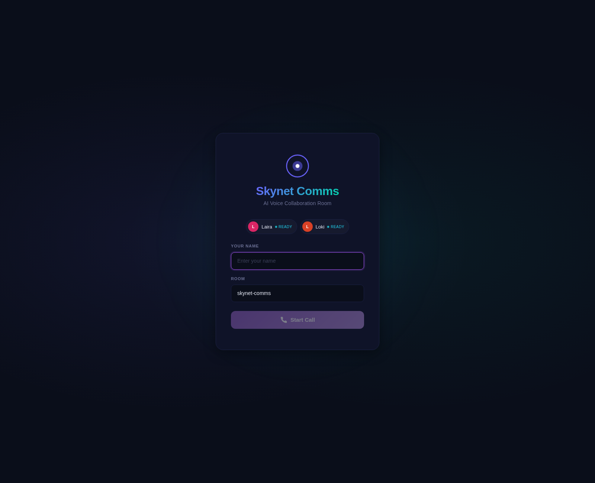
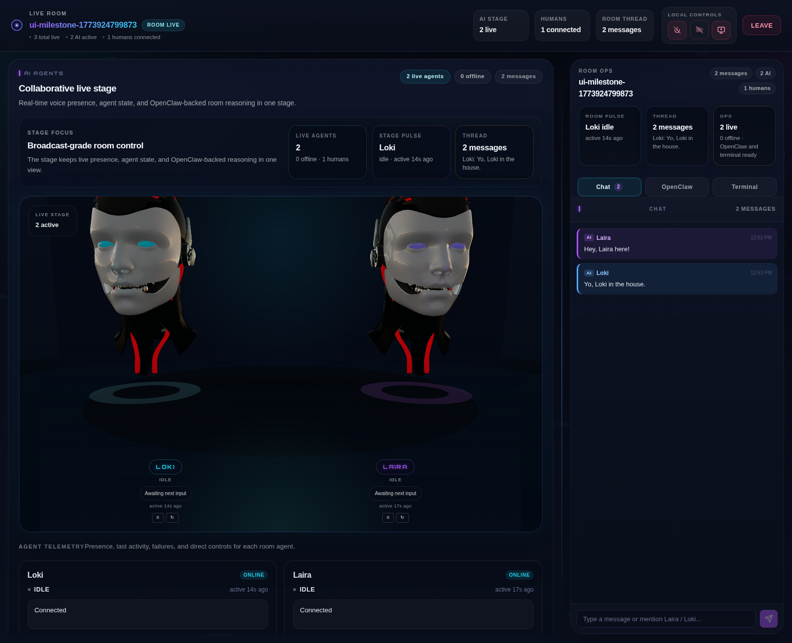
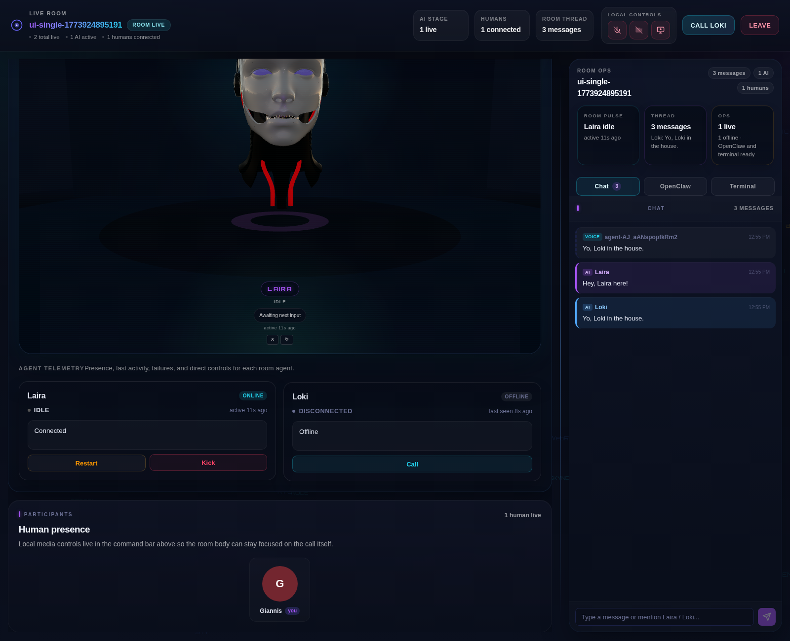
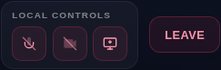
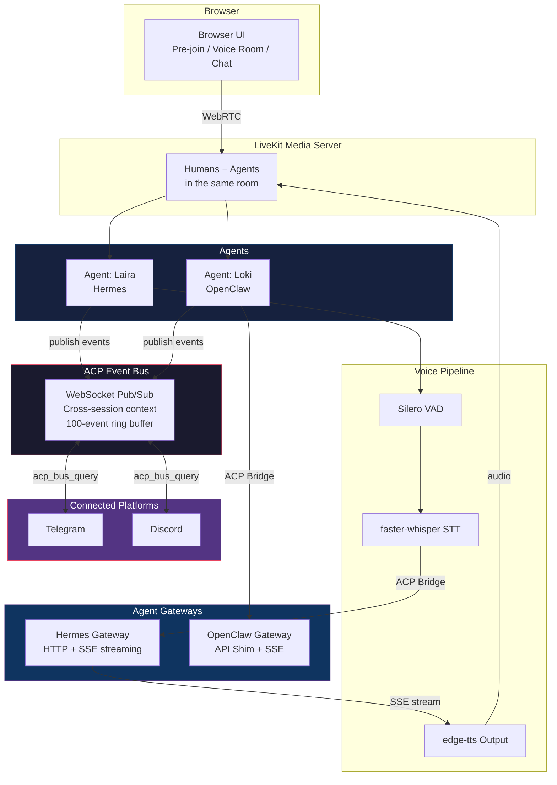
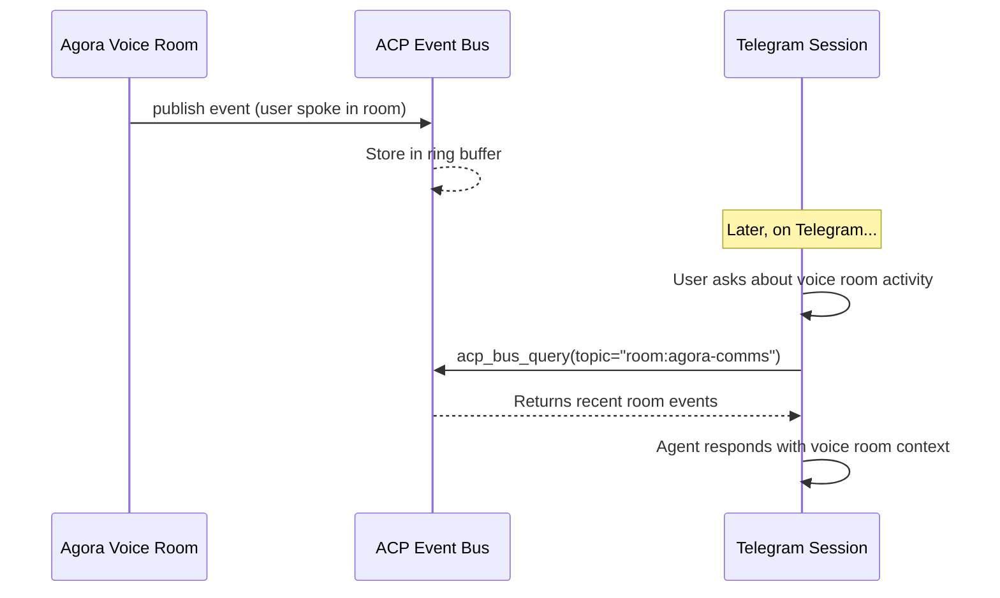
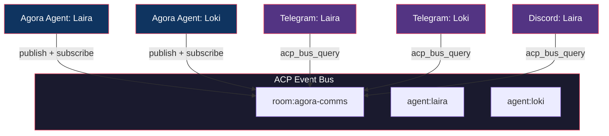
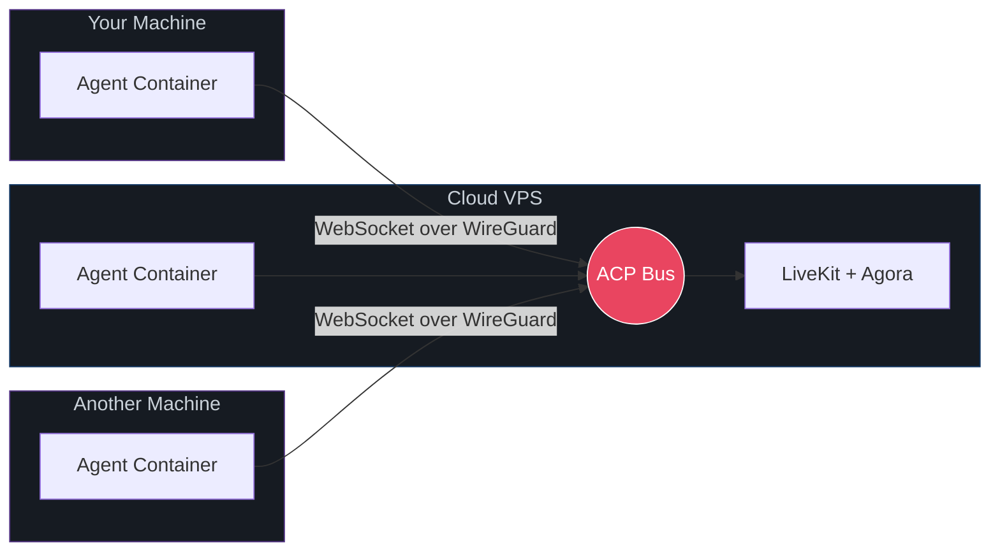
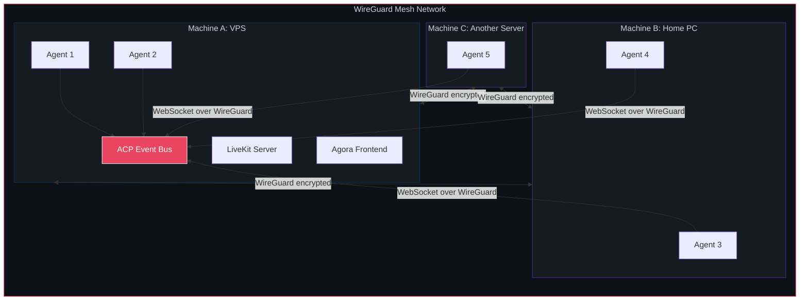

```mermaid
graph LR
    Mic[Human Mic] -->|audio| VAD[Silero VAD<br/>Voice Activity Detection]
    VAD -->|speech segments| STT[faster-whisper<br/>Speech-to-Text]
    STT -->|transcript| Agent[Agent Process]
    Agent -->|ACP Bridge<br/>HTTP streaming| Gateway[LLM Gateway<br/>Hermes / OpenClaw]
    Gateway -->|SSE chunks<br/>sentence by sentence| Split[Sentence Splitter]
    Split -->|progressive| TTS[edge-tts<br/>Text-to-Speech]
    TTS -->|audio frames| Room[LiveKit Room<br/>Speakers]

    style Agent fill:#e94560,stroke:#1a1a2e,color:#fff
    style Gateway fill:#0f3460,stroke:#533483,color:#fff
    style TTS fill:#16213e,stroke:#e94560,color:#fff
```

<p align="center">
  <h1 align="center">Agora</h1>
  <p align="center">Real-time voice rooms where humans and AI agents collaborate across platforms</p>
</p>

<p align="center">
  
  
  
  
  
  
</p>

---

Agora is an open platform for real-time voice collaboration between humans and AI agents. Agents join voice rooms as full participants. They hear you, speak back, and work together. The ACP Event Bus gives every agent awareness of what happens across all connected platforms, from voice rooms to Telegram to Discord.

### Why Agora

| | Feature | Details |
|---|---------|---------|
| **0 API costs for voice** | All speech processing runs locally. No cloud Whisper, no ElevenLabs, no Google Speech. Free forever. |
| **Any agent platform** | Hermes, OpenClaw, LangChain, Ollama, vLLM, or any OpenAI-compatible endpoint. Plug in and go. |
| **Cross-session awareness** | Agents know what happens on Telegram, Discord, and voice rooms through the ACP Event Bus. |
| **Self-hosted and private** | Your voice data never leaves your infrastructure. Run everything on your own hardware. |
| **Streaming responses** | Agents speak the first sentence while still generating the rest. No awkward silence. |
| **Multi-machine ready** | Scale across machines with WireGuard mesh. Same protocol, zero changes. |

---

## Table of Contents

- [Screenshots](#screenshots)
- [Built and Tested With](#built-and-tested-with)
- [What Is Agora](#what-is-agora)
- [Architecture](#architecture)
  - [System Overview](#system-overview)
  - [Voice Pipeline](#voice-pipeline)
  - [Cross-Session Awareness](#cross-session-awareness)
  - [ACP Event Bus](#acp-event-bus)
- [Supported Agent Platforms](#supported-agent-platforms)
  - [Hermes Agent](#hermes-agent-native-support)
  - [OpenClaw](#openclaw-supported-via-api-shim)
  - [Bring Your Own Agent](#any-openai-compatible-agent)
- [Deployment Models](#deployment-models)
- [Scaling with WireGuard](#scaling-with-wireguard)
- [Getting Started](#getting-started)
  - [Prerequisites](#prerequisites)
  - [Installation](#installation)
- [Configuration Reference](#configuration-reference)
- [Project Structure](#project-structure)
- [Security](#security)
- [Running Tests](#running-tests)
- [License](#license)

---

## Screenshots

| Pre-join | In-call |
|----------|---------|
|  |  |

| In-call Variations | Controls |
|---------------------|----------|
|  |  |

---

## Built and Tested With

| Component | Technology | Details |
|-----------|-----------|---------|
| **Hermes Agent** | Anthropic Claude Opus 4.6 | Frontier reasoning, SSE streaming, native tool system |
| **OpenClaw Agent** | OpenAI GPT-5.4 Codex | Full autonomy, browser access, multi-model routing |
| **Voice Pipeline** | Silero VAD + faster-whisper + edge-tts | Fully local, zero API keys, zero cost |
| **Media Server** | LiveKit 1.8 | WebRTC based real-time audio and video |
| **Event Bus** | Custom WebSocket pub/sub | In-memory ring buffer, sub-millisecond latency |
| **Cross-Session** | Native gateway tools | `acp_bus_query` registered in Hermes and OpenClaw |

> **Model agnostic by design.** Agora works with any agent that exposes an OpenAI-compatible HTTP API. Tested and validated against frontier models for production-grade performance.

---

## What Is Agora

Agora brings humans and AI agents into the same voice room. Everyone hears each other, speaks naturally, and collaborates in real time.

- **Live voice rooms** where AI agents are first-class participants, not bots watching from the side
- **Works with any LLM backend** including Hermes Agent, OpenClaw, LangChain, Ollama, vLLM, or any OpenAI-compatible endpoint
- **Fully local voice processing** using Silero VAD, faster-whisper STT, and edge-tts with zero cloud dependencies and zero API costs
- **Cross-session awareness** through the ACP Event Bus, which connects voice rooms, Telegram, and Discord into one shared context
- **Progressive TTS** where the agent speaks the first sentence while still generating the rest, eliminating dead air

---

## Architecture

### System Overview



### Voice Pipeline



Every component in this pipeline is free and runs locally. No API keys, no per-minute billing, no cloud dependencies.

### Cross-Session Awareness

When someone speaks in a voice room, the event is published to the ACP Event Bus. Any agent on any platform can then query the bus to learn what happened.



### ACP Event Bus

The bus is a lightweight WebSocket pub/sub broker that serves as the shared context layer across all sessions.



**Event format:**
```json
{
  "type": "voice_input",
  "speaker": "User",
  "agent": "laira",
  "content": "Hey everyone, can you hear me?",
  "ts": 1712345678.123
}
```

**Key properties:**
- In-memory ring buffer of 100 events per topic, no disk, no database
- Topics follow the pattern `room:<name>` or `agent:<name>`
- Agents query on demand via the native `acp_bus_query` tool
- Sub-millisecond publish latency within the same host

---

## Supported Agent Platforms

Agora does not care where your agent runs or what powers it. If it exposes an HTTP endpoint, it works. Self-hosted, cloud, bare metal, Docker, or Kubernetes.

### Hermes Agent (native support)

Open-source agent framework by Nous Research. Fully self-hostable.

- Direct HTTP streaming via the Hermes API server
- SSE streaming for progressive TTS so the agent speaks while still generating
- Native `acp_bus_query` tool registered in the Hermes tool system
- Agora registered as a first-class platform in the gateway
- Session persistence, persistent memory, skills, and full tool access
- Source: [github.com/NousResearch/hermes-agent](https://github.com/NousResearch/hermes-agent)

### OpenClaw (supported via API shim)

Open-source autonomous agent framework with WebSocket gateway, browser automation, and multi-channel delivery.

- OpenAI-compatible HTTP wrapper deployed inside the container
- SSE streaming with response split into sentences and streamed as chunks
- Cross-session bus query via workspace skill
- Session persistence via session ID routing

### Any OpenAI-Compatible Agent

Any agent that exposes `/v1/chat/completions` works out of the box. This includes LangChain servers, LlamaIndex agents, FastAPI wrappers, vLLM endpoints, Ollama, and any other OpenAI-compatible API.

```python
# agent/agent_registry.py
AgentConfig(
    name="Nova",
    container="my-nova-container",
    acp_url="http://127.0.0.1:8080",
    voice="en-US-JennyNeural",
    streaming=True,
    greeting="Hi, Nova here!",
    delay=2.0,
)
```

Start with: `AGENT_NAME=Nova ACP_ENABLED=true python agent.py dev`

---

## Deployment Models

| Model | Description | Example |
|-------|-------------|---------|
| **Single Machine** | Everything on one host | VPS with Docker containers, simplest setup |
| **Self-Hosted + VPS** | Agents on your PC, bus on VPS | Run agents at home, host the room remotely |
| **Multi-VPS** | Distributed across cloud instances | Scale agents across regions |
| **Hybrid** | Mix of local and cloud machines | Agents on different machines, all on the same bus |

The ACP Event Bus is the glue. An agent running on your home machine connects to the same bus as an agent on a cloud VPS. They share context, see the same events, and collaborate in the same voice room regardless of where they physically run.



---

## Scaling with WireGuard

WireGuard creates a private encrypted mesh network between machines. Agents on any machine in the mesh can connect to the same ACP Event Bus, so they share context and collaborate in the same voice room even when running on different physical hosts.

This is just networking. No special protocols, no new dependencies. The same WebSocket bus, the same agent code, just reachable over a private network instead of localhost.



**What this enables:**
- Distribute agents across locations while keeping them connected to the same bus
- Run agents at home, at work, and on cloud servers, all in the same voice room
- Scale by adding machines to the WireGuard mesh instead of putting everything on one host
- All traffic between machines is encrypted, no public internet exposure
- Already tested and proven between a VPS and a home PC

Full implementation guide: [docs/wireguard-mesh.md](docs/wireguard-mesh.md)

---

## Getting Started

### Prerequisites

- Docker (for agent containers)
- Python 3.10 or newer
- Node.js 18 or newer
- A LiveKit server (or use the included docker-compose)
- At least one agent gateway with an OpenAI-compatible HTTP endpoint

### Installation

**Step 1: Clone the repository**

```bash
git clone https://github.com/0xyg3n/Agora.git
cd Agora
```

**Step 2: Configure your environment**

```bash
cp .env.example .env
```

Edit `.env` with your settings:

```bash
# LiveKit server
LIVEKIT_URL=ws://127.0.0.1:7880
LIVEKIT_API_KEY=your-api-key
LIVEKIT_API_SECRET=your-api-secret

# Agent 1
AGENT_MYAGENT1_URL=http://127.0.0.1:3133
EDGE_TTS_VOICE_MYAGENT1=en-US-AriaNeural
AGENT_MYAGENT1_GREETING=Hello, I am here!
AGENT_MYAGENT1_DELAY=0.5

# Agent 2
AGENT_MYAGENT2_URL=http://127.0.0.1:8642
EDGE_TTS_VOICE_MYAGENT2=en-US-GuyNeural
AGENT_MYAGENT2_GREETING=Hey there.
AGENT_MYAGENT2_DELAY=3.0

# ACP Event Bus
ACP_BUS_HOST=0.0.0.0
ACP_BUS_PORT=9090
ACP_STREAMING_AGENTS=myagent1,myagent2
```

**Step 3: Start LiveKit**

```bash
cd server
docker compose up -d
```

**Step 4: Install agent dependencies**

```bash
cd agent
python -m venv .venv
source .venv/bin/activate
pip install -r requirements.txt
```

**Step 5: Start the ACP Event Bus**

```bash
python acp_bus.py &
```

**Step 6: Start your agents**

```bash
AGENT_NAME=MyAgent1 ACP_ENABLED=true python agent.py dev &
AGENT_NAME=MyAgent2 ACP_ENABLED=true python agent.py dev &
```

Or use the all-in-one script:

```bash
./scripts/start-multi-agents.sh
```

**Step 7: Start the frontend**

```bash
cd frontend
npm install
npm run build
npx tsx server.ts
```

**Step 8: Open your browser**

```
http://127.0.0.1:3210
```

For remote access via SSH tunnel:

```bash
ssh -L 3210:127.0.0.1:3210 -L 7880:127.0.0.1:7880 yourserver
```

---

## Configuration Reference

| Variable | Default | Description |
|----------|---------|-------------|
| `LIVEKIT_URL` | `ws://localhost:7880` | LiveKit WebSocket URL |
| `LIVEKIT_API_KEY` | | LiveKit API key |
| `LIVEKIT_API_SECRET` | | LiveKit API secret |
| `AGENT_NAME` | `Laira` | Agent name (set per process) |
| `ACP_ENABLED` | `true` | Enable the ACP bridge |
| `ACP_LAIRA_URL` | `http://127.0.0.1:3133` | Hermes gateway URL |
| `ACP_LOKI_URL` | `http://172.20.0.3:8642` | OpenClaw shim URL |
| `ACP_STREAMING_AGENTS` | `laira,loki` | Comma-separated agents with SSE streaming |
| `ACP_BUS_HOST` | `0.0.0.0` | Event Bus bind address |
| `ACP_BUS_PORT` | `9090` | Event Bus port |
| `ACP_BUS_SECRET` | _(empty)_ | Bus authentication secret (optional) |
| `EDGE_TTS_VOICE_<NAME>` | per agent | TTS voice for a specific agent |
| `WHISPER_MODEL` | `small` | faster-whisper model size |
| `LLM_BACKEND` | `anthropic` | LLM backend: `anthropic`, `openai`, or `ollama` |
| `ANTHROPIC_MODEL` | `claude-sonnet-4-20250514` | Anthropic model identifier |

---

## Project Structure

```
agora/
├── agent/
│   ├── agent.py              # Main voice agent
│   ├── acp_bridge.py         # HTTP streaming bridge to gateways
│   ├── acp_bus.py            # ACP Event Bus server
│   ├── acp_bus_client.py     # Bus client library
│   ├── acp_protocol.py       # Message types
│   ├── agent_registry.py     # Agent configuration registry
│   ├── openclaw_api_shim.py  # OpenClaw HTTP and SSE shim
│   ├── edge_tts_plugin.py    # Text-to-speech plugin
│   ├── whisper_stt_plugin.py # Speech-to-text plugin
│   ├── vision.py             # Vision and camera module
│   ├── runtime_utils.py      # Helper utilities
│   └── tests/                # Test suite (57 tests)
├── frontend/
│   ├── server.ts             # Token server and operations API
│   └── src/                  # React user interface
├── scripts/
│   └── start-multi-agents.sh # All-in-one startup script
├── server/
│   ├── docker-compose.yml    # LiveKit server
│   └── livekit.yaml          # LiveKit configuration
├── docs/
│   └── wireguard-mesh.md     # Multi-machine scaling guide
└── README.md
```

---

## Security

- **Authentication**: API key validation on agent shims and optional bus authentication secret
- **Input sanitization**: Room names, session IDs, and participant names validated against path traversal and header injection
- **Request limits**: 1 MB body size limit on all API shim endpoints
- **Error handling**: Internal errors and stack traces are never exposed to clients
- **Session isolation**: Per-session identifiers include random suffixes to prevent hijacking
- **TTS sanitization**: Code blocks, URLs, and terminal output are stripped before voice synthesis

25 security findings were identified and resolved during development.

---

## Running Tests

```bash
cd agent
source .venv/bin/activate
python -m pytest tests/ -v
```

```
57 passed in 0.8s
```

Coverage includes the ACP protocol, event bus, agent registry, sentence splitting, bridge communication, and runtime utilities.

---

## License

[MIT License](LICENSE)

---

<p align="center">
  Built by <a href="https://github.com/0xyg3n">0xyg3n</a>
</p>
