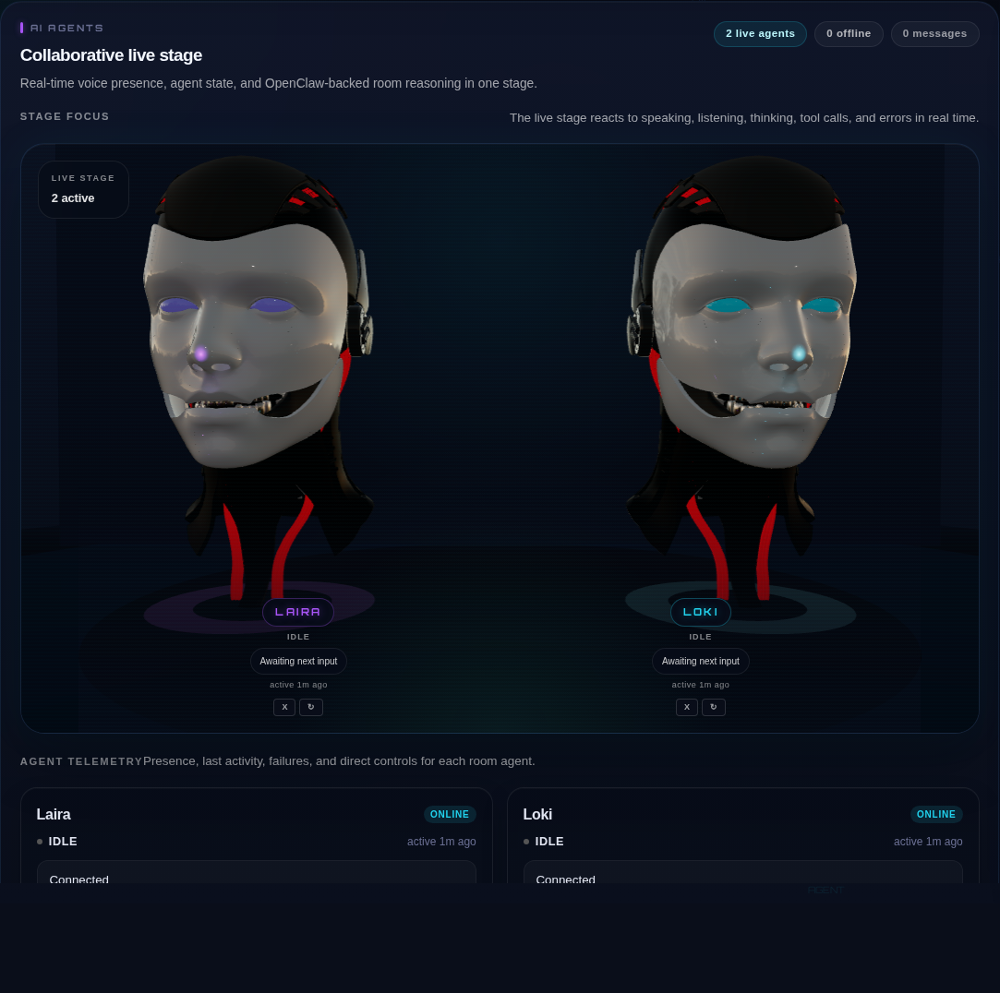

# Frontend

The frontend package contains both the browser UI and the local token and ops server for Agora.

## Screenshots




## What Lives Here

- React + TypeScript + Vite client
- Local Express server that issues LiveKit tokens and serves the built app
- Agent management endpoints for dispatch, restart, and kick
- Room-scoped observability APIs and WebSocket streams
- PTY-backed terminal service for the in-call terminal panel

## Key Files

- `server.ts`
  - token minting
  - agent dispatch endpoints
  - room-scoped agent snapshot cache
  - observability event ingestion and streaming
  - thermal session-log parsing
  - terminal WebSocket server
- `src/components/VoiceRoom.tsx`
  - main in-call experience
  - stage, cards, chat, right rail, controls
- `src/components/AgentModel3D.tsx`
  - 3D agent stage
  - state-reactive visuals tied to telemetry
- `src/components/OpenClawEventsPanel.tsx`
  - OpenClaw event and thermal monitor UI
- `src/components/TerminalPanel.tsx`
  - embedded terminal client
- `src/lib/agentTelemetry.ts`
  - shared derivation and hydration logic for agent state
- `tests/agentTelemetry.test.ts`
  - light regression coverage for frontend telemetry behavior

## Runtime Model

### Browser client

The browser joins a LiveKit room and renders:

- pre-join device selection
- premium in-call layout with central stage
- agent telemetry cards
- chat with transcripts and agent replies
- right rail tabs:
  - `Chat`
  - `OpenClaw`
  - `Terminal`

### Server-side companion

`server.ts` binds to `127.0.0.1:3210` and provides:

- `POST /api/token`
- `GET /api/agents`
- `POST /api/agent/status`
- `POST /api/agent/dispatch`
- `POST /api/agent/dispatch-all`
- `POST /api/agent/restart`
- `POST /api/agent/kick`
- `POST /api/observability/events`
- `GET /api/observability/events/recent`
- `GET /api/observability/thermal/recent`
- `WS /api/observability/stream`
- `WS /api/terminal/ws`

## Current UX Semantics

- Agents are manually dispatched by default.
- The UI persists last-known agent state per room through the server snapshot cache.
- Live state comes from participant attributes and speaking detection, not from log scraping.
- The OpenClaw tab combines:
  - bridge lifecycle events
  - room thermal timeline parsed from session JSONL
- The terminal tab uses a PTY-backed WebSocket session.

## Development

Install dependencies:

```bash
npm install
```

Run the Vite dev server:

```bash
npm run dev
```

Run the local token and ops server directly:

```bash
npm run serve
```

Build the package:

```bash
npm run build
```

Run the frontend telemetry regression test:

```bash
npm run test:telemetry
```

## Notes

- `npm run serve` expects the root `.env` values to be available in the process environment.
- The current production-style flow is usually: `npm run build` followed by `npx tsx server.ts`.
- The 3D stage, OpenClaw tab, and terminal are lazily loaded to keep the initial room bundle smaller than a single monolithic mount.
- The repo intentionally keeps the in-call UI and local ops server together so deployment stays simple on the target machine.
